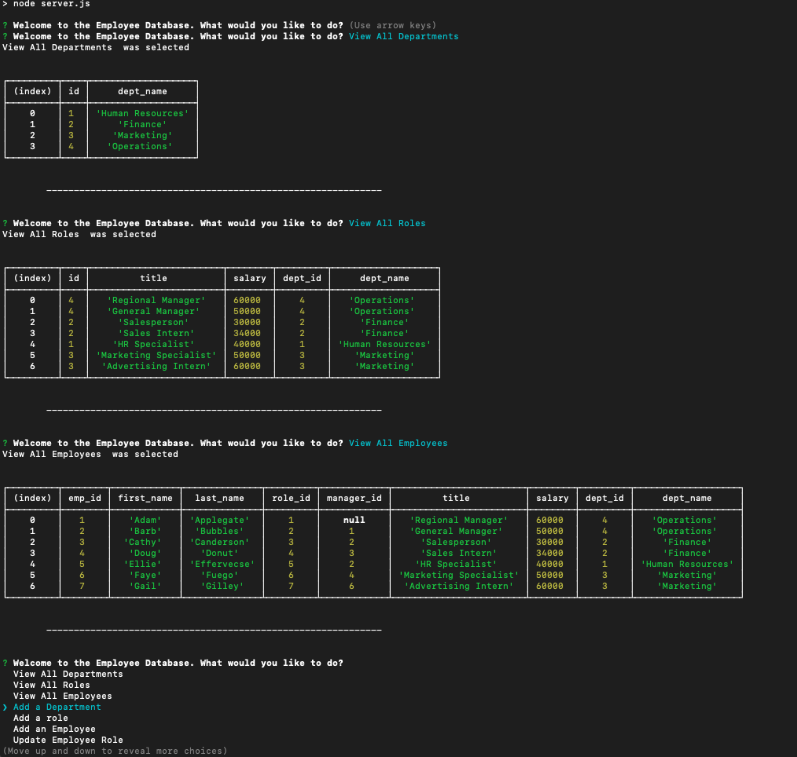

# challenge-twelve-employees
Challenge 12 Repo of our bootcamp. Tasked with creating a CMS using Node.js, MySQL, and inquirer to allow someone to view the employee database

## What is the purpose of this app?
The purpose of this app is to allow the user to browse throughout their database. They can View All Departments, View ALl Employees, View All Roles, Edit and Update Employees, and more. This could be used in the HR or hiring department of a company, and could be used to update salaries incase of promotions.

## How did I build it?
I build this primarily with Javascript, MySQL and using Inquirer in Node.JS. 

## Where can I see it/what does it look like?
You can see this page at this link, and an image of what it looks like can be found below.

